# Library Management System

The **Library Management System (LMS)** is a comprehensive tool designed to automate and streamline library operations. It facilitates book and student record management, book issuance and return, and overdue fine calculations, making library management efficient and user-friendly.

---

## 📖 Features
- **Login System**: Secure login for librarians, with error handling for incorrect credentials.
- **Student Registration**: Add and manage student details with validation for missing fields.
- **Book Management**: Add book records.
- **Book Issuance and Returns**: Track book borrowings and calculate fines for overdue returns.
- **Fine Calculation**: Automatically calculate fines at Rs. 10 per day for late returns.
- **Error Handling**: Prompt users for missing or incorrect data inputs.

---

## 🛠️ Technology Stack
- **Frontend**: Java (NetBeans IDE)
- **Backend**: MySQL
- **Build Tool**: Apache Ant

---

## 🎯 Objectives
1. Simplify the library's operational processes with a user-friendly system.
2. Ensure accurate fine calculations for overdue books.
3. Enable seamless management of book and student records.
4. Provide robust error-handling mechanisms.

---

## 🚀 How It Works
1. **Loading Page**: Displays a splash screen before login.
2. **Login Page**: Authenticates the librarian's credentials.
3. **Home Page**: Central hub for accessing functionalities.
4. **Student Registration**: Capture student details such as ID, name, course, branch, and semester.
5. **Book Management**: Add book records with ID, name, publisher, price, and year of publication.
6. **Issue & Return**: Handle book borrowing and return processes.

---

## 🖼️ Project Workflow

### ER Diagram
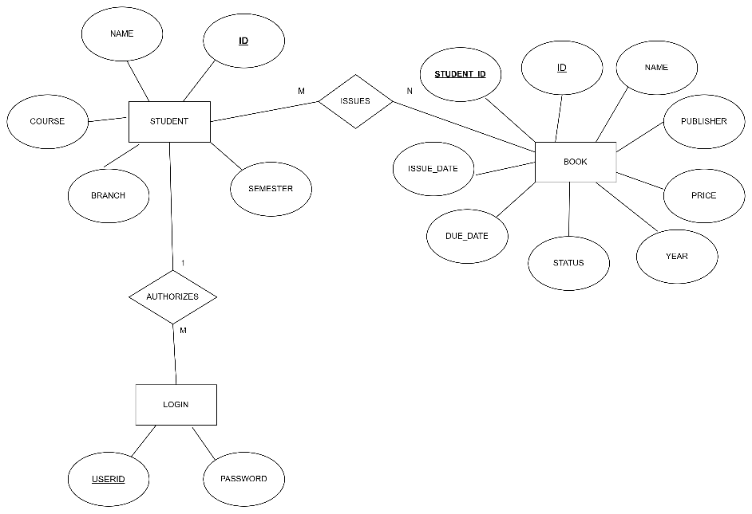

### Working Demo Screenshots


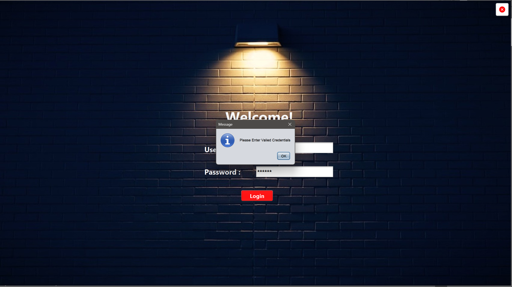


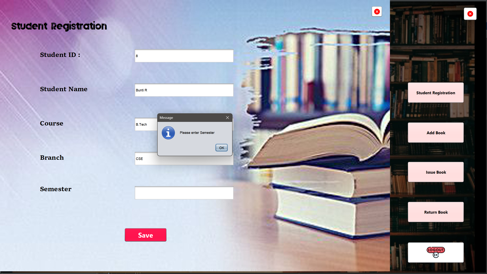


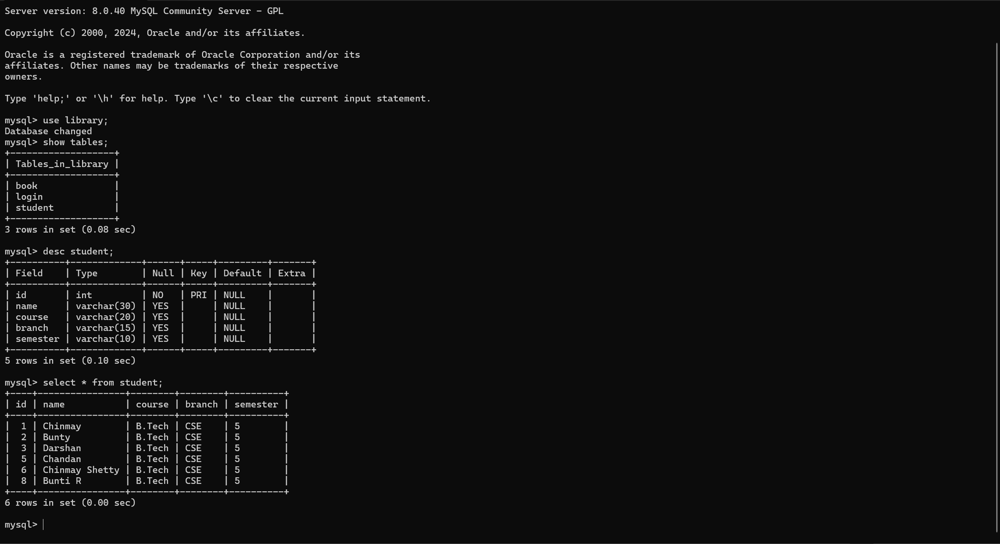


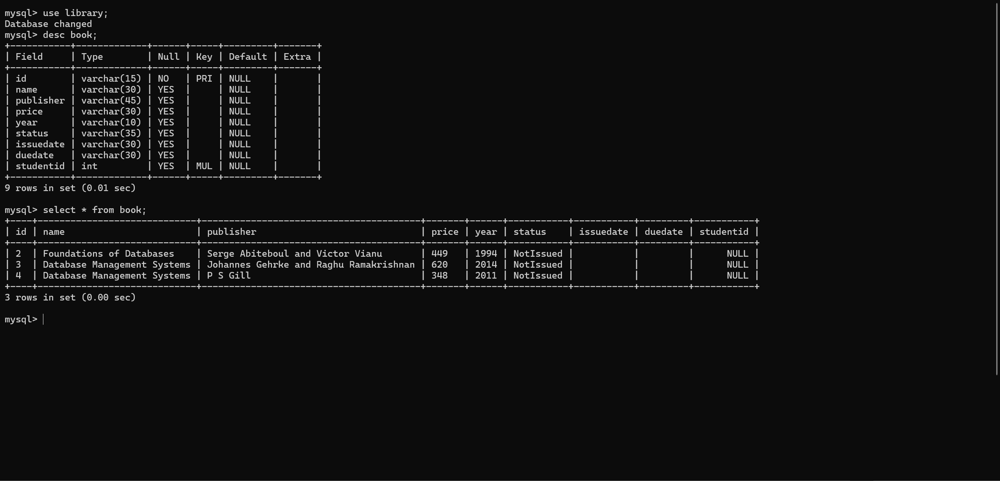

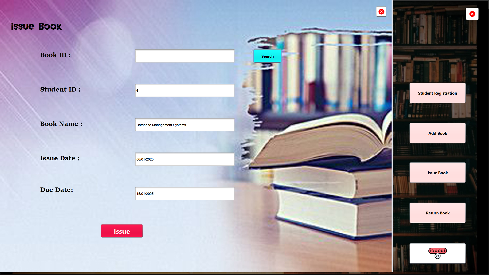

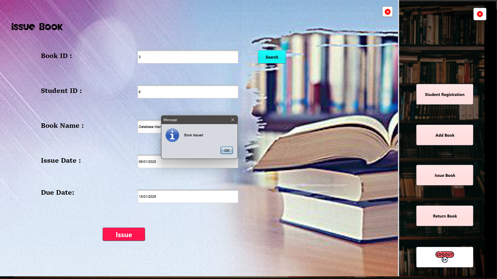

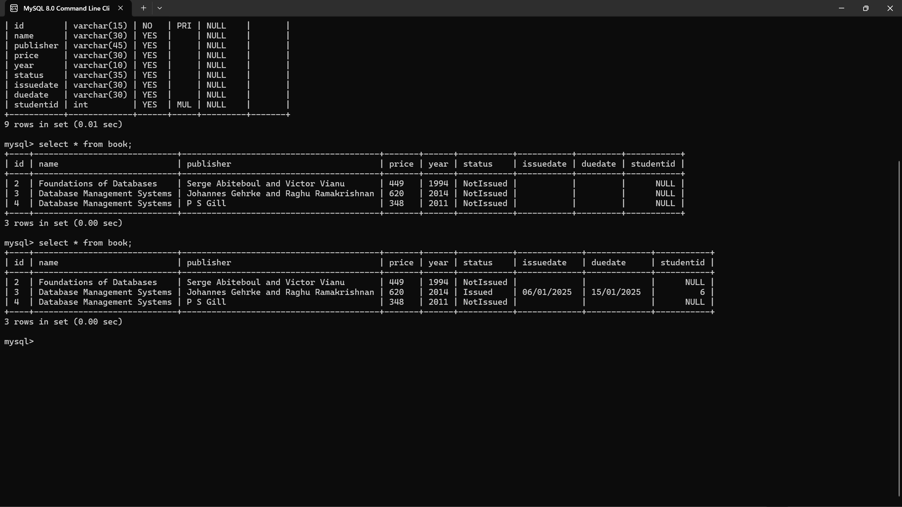

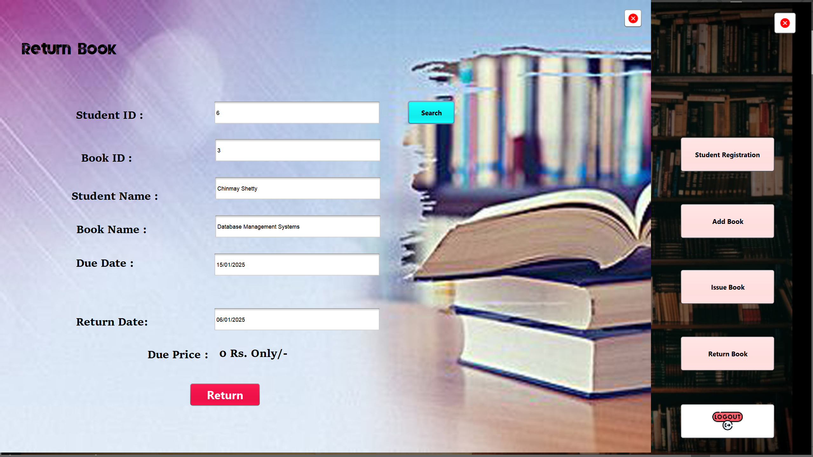

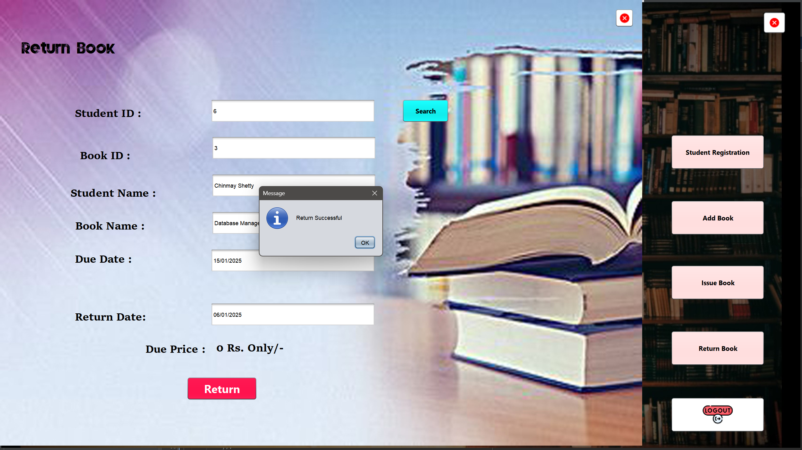

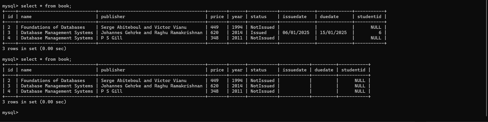

---

## 📊 Results
- **Book Issue Success Rate**: 100%
- **Student Registration**: Validated and error-free.
- **Fine Calculation**: Accurate fines for overdue returns.
- **UI Usability**: Intuitive interface with robust error-handling.

---


## 📝 Usage Instructions
1. Clone the repository:
   ```bash
   git clone https://github.com/CKShetty4/Library-Management-System.git
   ```
2. Import the project into **NetBeans IDE**.
3. Configure MySQL database:
   - Import the provided database schema.
   - Update the connection details in the source code.
4. Build and run the project using **Apache Ant** or directly from the IDE.

---

## 📌 Contributing
1. Fork the repository.
2. Create a new branch for your feature/bug fix.
3. Commit your changes and submit a pull request.

---

## 📄 License
This project is licensed under the MIT License.

---

### 🛠️ Contribution Guidelines
Contributions are welcome! Refer to the issues tab to get started.

### 📧 Contact
For any queries, please email: [dev.ckshetty@gmail.com](mailto:dev.ckshetty@gmail.com).
